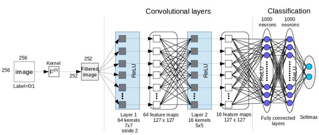
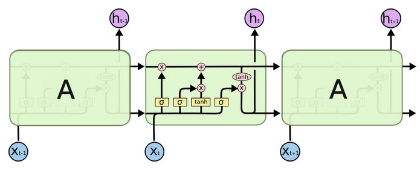

## FeUdal Networks for Hierarchical Reinforcement Learning
论文链接：[FeUdal Networks for Hierarchical Reinforcement Learning](https://arxiv.org/pdf/1703.01161.pdf)。产自DeepMind。

### 一、 关键词
- long-term credit assignment：
类似于sparse reward的描述。**agent需要不断地得到reward，但是环境给予的reward时间跨度太大**，比如下棋，只有当最终赢了或输了才有reward，而agent需要知道每一步的reward，才能决定下一步的action。

- feudal reinforcement learning (FRL): Dayan & Hinton提出来的分层强化学习框架，算是分层强化学习的鼻祖。key insights如下：
    - goals can be generated in a top-down fashion。 **通常形成上下分层的结构**。
    - goal setting can be decoupled from goal achievement. **也就是一个负责设置goal，而另一个负责实现goal，两者互不干扰，互相解耦**
    - a level in the hierachy communicates to be the level below it what must be achieved, but does not specify how to do so. **上一层通知下一层必须实现什么目标，但不关心下一层如何去实现它**

- von Mises-Fisher distribution:

- inductive bias ：归纳偏好，Inductive bias is the set of assumptions a learner uses to predict results given inputs it has not yet encountered。**就是机器学习算法在学习过程中对某种类型假设的偏好。**

### 二、 简述
#### 1. 待解决的问题
- very long-term credit assignment problem

- non-Markovian enviroment that require memory，**agent怎么去学习存储哪些经历**。

- sub-policies (goals) 如何得到

#### 2. 采用的方法及理论
- 提出FeUdal Networks(FuNs), **a novel architecture for hierarchical reinforcement learning.**

- framework中包含一个manager和一个worker。
    - The Manager sets goals at a lower temporal resolution in a latent state-space that is itself learnt by the manager. **manager在自己学出来的state-space中设定goals**
    - The Worker operates at a higher temporal resolution and produces primitive actions, conditioned on the goals receiced from the manager. The worker is motivated to follow the goals by an intrinsic reward. **worker根据intrinsic reward的激励一步步实现manager下达的goal**

- 采用的神经网络结构是完全可微的。

- 提出用于manager训练的**transition policy gradient**，可以发掘产生goals背后的语义。

- 所确定的goals是具体的，量化的，而不是抽象的。本文中goals实质上是**advantageous direction** in the latent state space，**状态空间中的优势方向**。

- 为manager设计了一种**dilated LSTM**的RNN网络结构，可以延长recurrent state memories的寿命，and allows gradients to flow through large hops in time。

- 加入pseudo-reward

### 三、 建模过程
#### 1. 整体框架
- Manager有两个关键工作：computes a latent state representation $s_t$ and ouputs a goal vector $g_t$。**计算潜在的状态表达 $s_t$ 和 目标向量 $g_t$**。

- Manager的训练方法采用*transition policy gradient*。

- Worker的主要工作就是：produces actions conditioned on external obervation, its own state, and the Managers goal。 **就是获得primitive action，换句话说，就是policy over actions**。

- Worker的训练方法采用*policy gradient*。

- 框架图如下所示：

注意到图中manager的rnn出来的 $g_t$ 是 $d$ 维的，但是worker的rnn出来的 $U_t$ 中每一行向量都是 $k$ 维的，而且 $k \ll d$。

- 上图相应的动态方程如下所示：
$$ z_t = f^{percept}(x_t); s_t = f^{Mspace}(zt); $$
$$ h_t^M, \hat{g}_t = f^{Mrnn}(s_t, h_{t-1}^M); g_t = \hat{g}_t / \| \hat{g} \|; $$
$$ \omega_t = \phi \left( \sum_{i=t-c}^t g_t \right) $$
$$ h_t^W, U_t = f^{Wrnn}(z_t,h_{t-1}^W); \pi_t = SoftMax(U_t \omega_t) $$
各个符号的意义如下：
    - $z_t$ : 是Manager和Worker共享的状态表示，称为中间表示(intermediate representation)，通过 $f^{precept}$ 把观测值转化得来。
    - $s_t$ : 是Manager计算的state representation，通过 $f^{Mspace}$ 把 $z_t$ 转化得来。
    - $h_t^M$ 和 $h_t^W$ ：分别是manager和worker在t时刻下的内部状态值。（此处“状态”是指RNN中的状态）
    - $\hat{g}_t$ ：是指manager中的rnn网络得到的子目标估测值。 $g_t$ 表示它的单位向量，也就是 $\hat{g}_t$的 方向。
    - $\omega_t$ :是指经过线性变换 $\phi$ 把单位向量 $g_t$ 映射到 $\mathbb{R}^k$ 域的嵌入向量(embedding vector)。 $\phi$ 实质上是一个降维的操作，把高维度的 $g_t$映射到低维度的 $\omega_t$。需要综合的时间长度为$c$。
    - $U_t$ :是指worker中的rnn网络得到的输出。
    - $\pi_t$ :是指动作策略(vector of probabilities over primitive actions)，通过 $U_t$ 与 $\omega_t$ 的乘积并传入softmax网络（softmax网络可以自己定义）得到。

- $\phi$ 是一个线性映射，不带有偏置项。通过这个映射把前面 $c$ 个goals组合并映射到 $\mathbb{R}^k$ ，也就是向量 $\omega$。由于 $\phi$ 不带有偏置项，也就是说映射后的值可能为0，相当于可以忽略掉manager的指令。另外对前 $c$ 个goals的组合使得每个goal都能影响到最终的策略，并且 $\omega$ 的变化也更加顺滑。

#### 2. 学习过程
对manager和worker采用独立的更新方式，manager不会利用worker的gradient。

- manager的更新公式如下所示。 $A_t^M$ 是manager的优势函数， $V_t^M (x_t, \theta)$ 是internal critic对值函数的估计值，$d_{cos}$ 是余弦相似度。
$$ \bigtriangledown g_t = A_t^M \bigtriangledown_\theta d_{cos} (s_{t+c} - s_t, g_t(\theta)) $$
$$ A_t^M = R_t - V_t^M (x_t, \theta) $$
$$ d_{cos} (\alpha, \beta) = \alpha^T \beta / (|\alpha||\beta|) $$

- 上面的manager更新公式是怎么来的呢？答案是通过 *transition policy gradients*，详细过程如下：
    - 首先将上层策略定义为 $o_t = \mu(s_t,\theta)$，对应地出现转移概率 $p(s_{t+c} | s_t, o_t)$，也就是说，当起始状态 $s_t$ 和 上层策略$o_t$给定时，出现状态 $s_{t+c}$ 的概率。这就意味着把Worker连续 $c$ 步的产生的状态变化当做一步transition。
    - 定义**transition policy**为 $\pi^{TP}(s_{t+c}|s_t) = p(s_{t+c}|s_t,\mu(s_t,\theta))$。为什么可以这样定义？论文中的解释是 **because the original MDP is isomorphic to a new MDP with policy $\pi^{TP}$** 。 (咱也不敢说，咱也不敢问。。。)有了这个transition policy，就可以求梯度了：

    $$ \bigtriangledown_\theta \pi_t^{TP} = \mathbb{E} \left[ \left(R_t - V(s_t) \right) \bigtriangledown_\theta \log p \left(s_{t+c}|s_t, \mu(s_t,\theta) \right) \right] $$

    - 接下来论文做了一个重要假设，FuN assumes a particular form for the transition model: that the direction in state-space, $s_{t+c}-s_t$, follows a von Mises-Fisher distribution. 也就是说transition policy满足冯·米塞斯分布，这样就可以得到 $p(s_{t+c}|s_t,o_t) \varpropto e^{d_{cos}(s_{t+c}-s_t,g_t)}$，因此就能得到manager更新公式的最终形式：

    $$ \bigtriangledown g_t = A_t^M \bigtriangledown_\theta d_{cos} (s_{t+c} - s_t, g_t(\theta)) $$

- worker的intrinsic reward定义如下：
$$ r_t^I = \frac{1}{c} \sum_{i=1}^c d_{cos}(s_t - s_{t-i}, g_{t-i}) $$

- worker的更新公式如下所示。有了intrinsic reward之后，可以直接利用A3C框架去训练worker。需要注意worker的目标是最大化 $R_t + \alpha R_t^I$ ，其中 $R_t$ 是discounted environment reward (extrinsic reward)， $R_t^I$ 应该是discounted intrinsic reward。公式中的 $A_t^D$ 是worker的优势函数，$V_t^D (x_t, \theta)$ 是internal critic对值函数的估计值
$$ \bigtriangledown \pi_t = A_t^D \bigtriangledown_\theta \log \pi(a_t|x_t;\theta) $$
$$ A_t^D = \left(R_t + \alpha R_t^I - V_t^D(x_t;\theta) \right) $$

- 计算折扣回报时，manager和worker可以有不同的折扣因子 $\gamma$ ，worker的折扣因子可以小一点，表示注重当前的回报；manager的折扣因子可以大一点，表示注重长期的回报。

#### 3. 网络结构
- $f^{percept}$ 用的是CNN网络，最终跟着全连接层和非线性激活函数。

- $f^{Mspace}$ 用的是全连接层和非线性激活函数。

- $f^{Wrnn}$ 用的是standard LSTM([LONG SHORT-TERM MEMORY](http://www.yangwenlong.org/wp-content/uploads/2015/11/Hochreiter97_lstm.pdf))

- $f^{Mrnn1}$ 用的是dilated LSTM，目的是得到变化缓慢的输出的归纳偏好，从而能拥有更长期的记忆。(The main contribution here is the inductive bias towards slowly varying outputs, which have very long-term temporal dependencies.)

- CNN卷积神经网络结构示意图

    

- LSTM循环神经网络示意图

    

### 四、 总结
- 之前以为state space就是observation space, 但是现在知道还有一种东西叫做：state representation。只能说observation space可以生成state space。

- 这篇文章没有直接用得到的goal，而是用goal的方向，interesting 。

- 状态空间、动作空间是连续值还是离散值，有多少个维度，这两个问题不要搞混。

- 整个网络都是通过梯度下降去更新的，最终通过反向传播更新整个网络的参数。每个子网络都是和下一个子网络相连的，并不是孤立的。

- 论文中整个流程从头到尾都是可微的，直接用现成的RL算法就可以end-to-end训练了，为什么还要分层？

    Manager产生的goal就等于是一个hidden variable，没有对应的可以说的明白的含义了。因此，训练必须把两层分来做训练。

- 文中用的dilated LSTM有什么用？

    为了让Manager确实能比Worker记忆的时间更长，自然想法就是每 $c$ 步才喂一个数据到Manager的LSTM里面。但是这样可能漏掉中间的一些信息。然后自然会想到，弄 $r$ 个这样的LSTM，每步数据进来的时候只训练其中的第 $t%r$ 个模型（%表示取余）。这就是文章里面提到的dilated LSTM。

#### 1. 工作概括
建立了feudal networks为框架的分层强化学习方法

对observation space进行特征提取和表达。

具体化了manager(上层)输出的goals的语义，本文中goals的语义是**advantageous direction in the latent state space**。
#### 2. 不足之处
论文中假设transition policy满足冯·米塞斯分布，这里面没有严格的数学证明，只是一种假设。也就是说同样可以假设为另外一种分布的形式。（估计是假设满足冯·米塞斯分布让更新公式变得简单）